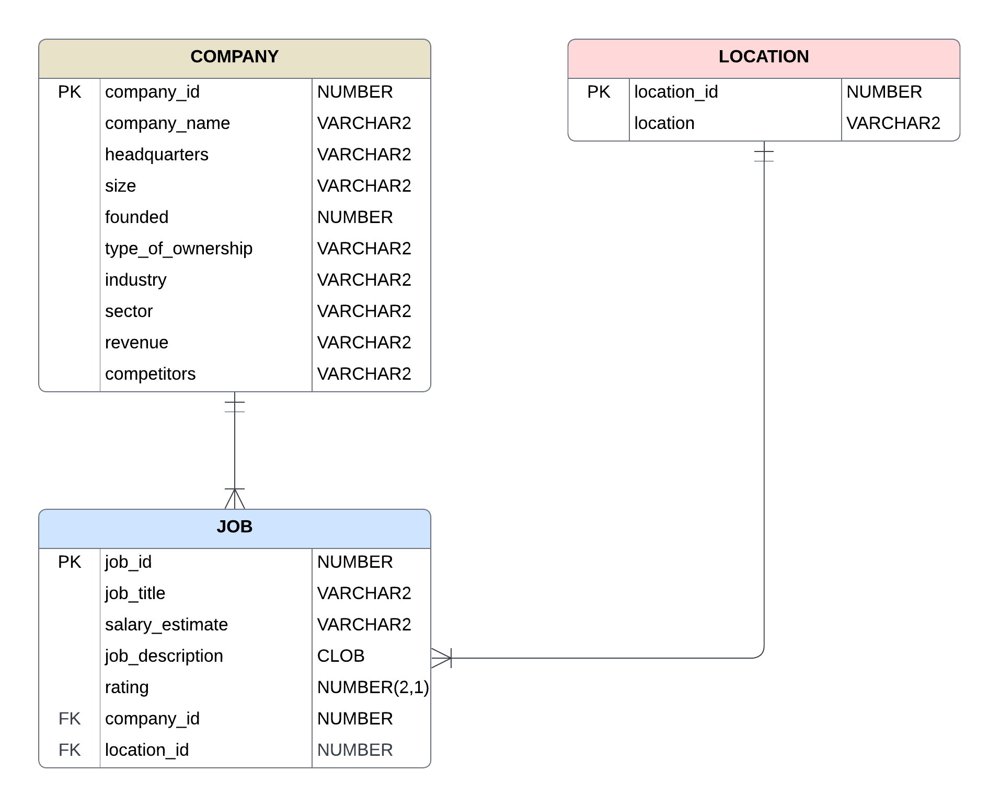

# DS_Jobs_SQL

## Overview
This repository contains SQL scripts for processing, cleaning, transforming, and analyzing a dataset of job market data. The tasks include creating relational database schemas, handling data cleaning operations such as checking for duplicates and handling null values, and performing complex queries involving filtering, aggregating, joining, and grouping data from multiple tables. The scripts are written for an Oracle PL/SQL environment.

Key features:

- Creation of relational tables for jobs, companies, and locations.
- Insertion of data into the respective tables with appropriate foreign key relationships.
- Data cleaning operations to ensure data quality and integrity.
- Advanced SQL queries to extract meaningful insights from the dataset.
- Comprehensive examples of using subqueries, window functions, and Common Table Expressions (CTEs).

## Dataset
The dataset used in this project is provided as `Uncleaned_DS_jobs.csv`. It includes web scrapped job posts from glassdoor for data science job listings with various attributes such as job title, company name, location, salary estimate, and more.

## Repository Contents
- **`create_table.sql`**: Script for creating relational tables (`jobs`, `companies`, `locations`).
- **`insert_data.sql`**: Script for inserting data into the tables with appropriate foreign key relationships.
- **`clean_data.sql`**: Script for cleaning data, including handling duplicates and null values.
- **`data_insight.sql`**: Examples of complex SQL queries involving filtering, aggregating, joining, and grouping data.
- **`Uncleaned_DS_jobs.csv`**: The dataset used for this project.

## Entity-Relationship Diagram



### Relationships:

#### Company to Job: One-to-Many relationship.
A single Company can be associated with multiple Jobs.
company_id in Job table is a foreign key that references company_id in Company table.

#### Location to Job: One-to-Many relationship.
A single Location can be associated with multiple Jobs.
location_id in Job table is a foreign key that references location_id in Location table.

### ERD Explanation:
- Company Table:
company_id is the primary key (PK).
company_id is referenced as a foreign key (FK) in the Job table.

- Location Table:
location_id is the primary key (PK).
location_id is referenced as a foreign key (FK) in the Job table.

- Job Table:
job_id is the primary key (PK).
company_id and location_id are foreign keys (FK) that establish relationships with the Company and Location tables, respectively.


## Setup Instructions

### Clone the Repository
```bash
git clone https://github.com/yourusername/DS_Jobs_SQL.git
cd <repo dir>
```
